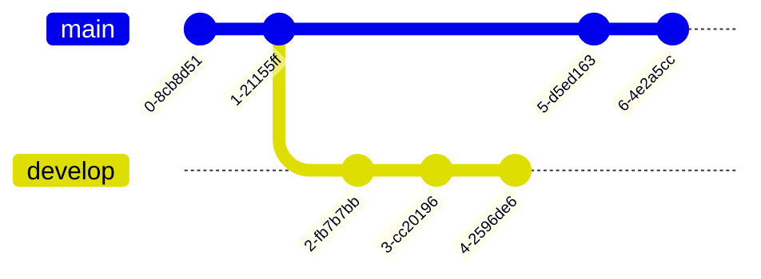

### フローチャート

 

#### memo 1. 

`flowchart TDはフローチャートの記載を宣言し、TDはTop⇒Downの方向にノードを並べるという意味。ほかにもLR,RL,BT(Bottom To Top)がある`

`A[Christmas]:四角形ノードの作成` 
`B(Go shopping):丸ノード` 
`-->:矢印` 
`|Get money|:矢印にラベルを表示` 
`C{Let me think}:ひし形の条件分岐ノードの作成` 
`F[fa:fa-car Car]：Font Awesomeアイコン付きノード`

 

 

## シーケンス図

 

## ガントチャート

 

#### memo 2.

`gantt:ここからシーケンス図を描き始める宣言` 
`dateFormat YYYY-MM-DD:日付の表示形式の指定` 
`excludes weekdays 2014-01-10:特定の日付を除外、excludes weekendsで土日を除外` 
`:done：ステータス指定(完了タスクを緑で表示)` 
`des1：タスクID(他のタスクから参照できる)`
`2022-07-06,2022-07-08：開始日、終了日`
`:active：進行中のタスク(青系の色で表示)`
`after des2：des2(アクティブなタスク)の終了後に開始`

 

## クラス図

 

#### memo 3. 

`classDiagram:- Mermaidでクラス図を描くことを宣言します。`

## Gitグラフ

 

#### memo 4. 

