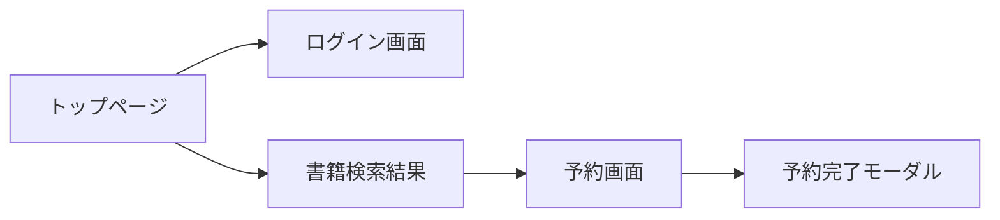
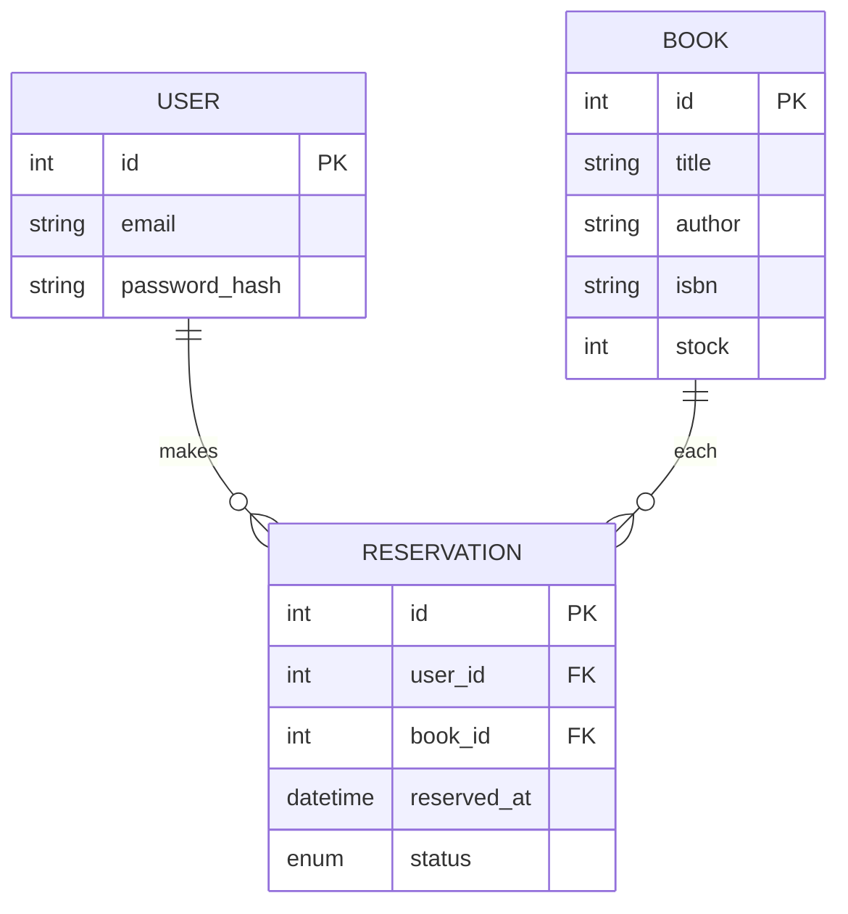
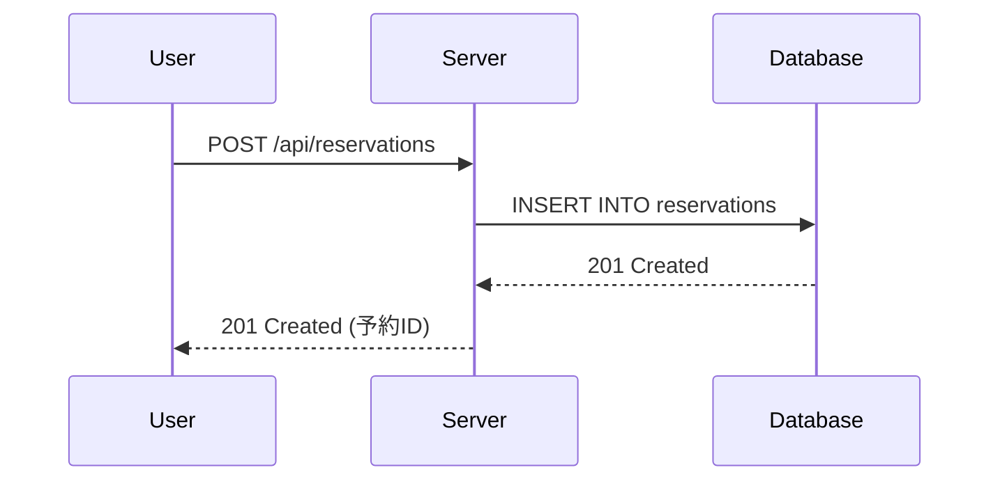
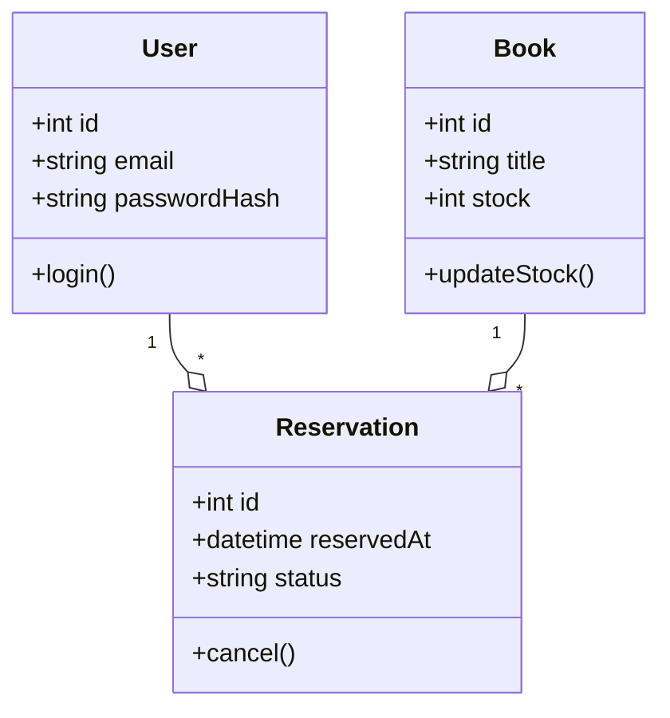

# 詳細設計書
## 1. 目的と背景

オンライン上で書籍を検索・予約し、図書館や書店の在庫状況を確認できるWebアプリを開発します。<br>
利用者の利便性向上と管理者の業務効率化を実現することが目的です。

<br>


## 2. 用語定義

|用語     |説明                                  
|:--------|:------------------------------------
|ユーザ   |Webアプリを使用する一般会員
|管理者   |在庫管理および予約状況の運用を行う担当者
|ISBN     |書籍の国際標準図書番号
|REST API |クライアントとサーバ間の通信仕様

<br>


## 3. ユースケース一覧
No.  |ユースケース名      |アクター|概要
:----|:------------------|:------|----
UC1  |会員登録            |ユーザ |メールアドレスとパスワードで登録
UC2  |ログイン／ログアウト |ユーザ |認証してサービス利用可否を管理
UC3  |書籍検索            |ユーザ |タイトル／著者／ISBNで絞り込み
UC4  |予約・キャンセル     |ユーザ |在庫数を確認して操作
UC5  |在庫管理            |管理者 |書籍情報の追加・更新・削除

<br>


## 4. 画面設計(ワイヤーフレーム)



画面遷移イメージは上記の通りです。

<br>


## 5. DB設計
### 5.1 ER図



### 5.2 テーブル定義

テーブル名   |カラム名      |型                                  |制約    |説明
:-----------|:------------|:-----------------------------------|:-------|:----
User        |id           |INT                                 |PK,AI   |ユーザ識別子
|           |email        |VARCHAR(255)                        |UNIQUE  |ログイン用メールアドレス
|           |password_hash|VARCHAR(255)                        |NOT NULL|ハッシュ化パスワード
books       |id           |INT                                 |PK, AI  |書籍識別子
|           |title        |VARCHAR(500)                        |NOT NULL|書名
|           |author       |VARCHAR(255)                        |NOT NULL|著者名
|           |isbn         |VARCHAR(13)                         |UNIQUE  |ISBN番号
|           |stock        |INT                                 |NOT NULL|在庫数
reservations|id           |INT                                 |PK, AI  |予約識別子
|           |user_id      |INT                                 |FK      |users.id参照
|           |book_id      |INT                                 |FK      |books.id参照
|           |reserved_at  |DATETIME                            |NOT NULL|予約日時
|           |status       |ENUM(‘open’, ‘cancelled’, ‘expired’)|NOT NULL|予約状態

<br>


## 6. API設計
### 6.1 エンドポイント一覧

メソッド   |パス                  |機能
:---------|:---------------------|:----
POST      |/api/users/register   |会員登録
POST      |/api/users/login      |ログイン
GET       |/api/books            |書籍検索
POST      |/api/reservations     |書籍予約
DELETE    |/api/reservations/{id}|予約キャンセル


### 6.2 リクエスト/レスポンス例

```http
POST /api/users/login
Content-Type: application/json

{
  "email": "user@example.com",
  "password": "Secret123"
}

HTTP/1.1 200 OK
Content-Type: application/json

{
  "token": "eyJhbGciOiJIUzI1NiIsInR5cCI6IkpXVCJ9..."
}
```

<br>


## 7. シーケンス図



<br>


## 8. クラス図



<br>


## 9. エラーハンドリング設計

- 400 Bad Request
    - リクエストパラメータ不正
- 401 Unauthorized
    - 認証トークン未提供／期限切れ
- 404 Not Found
    - リソース（書籍・予約ID）未存在
- 500 Internal Server Error
    - サーバ内部の予期せぬ例外


<br>


## 10. テストケース一覧
No.  |試験項目          |前提条件           |入力                    |期待結果
:----|:----------------|:----------------- |:----------------------|:---------
TC1  |正常会員登録      |なし               |valid email/password   |201 Created
TC2  |ログイン失敗      |未登録メール        |invalid@example.com/123|401 Unauthorized
TC3  |書籍検索(タイトル)|複数書籍登録済み    |title contains “Java”   |マッチするリスト返却
TC4  |在庫オーバー予約  |stock=0 の書籍がある|reserve book with id=5  |400 Bad Request (“在庫なし”)

<br>